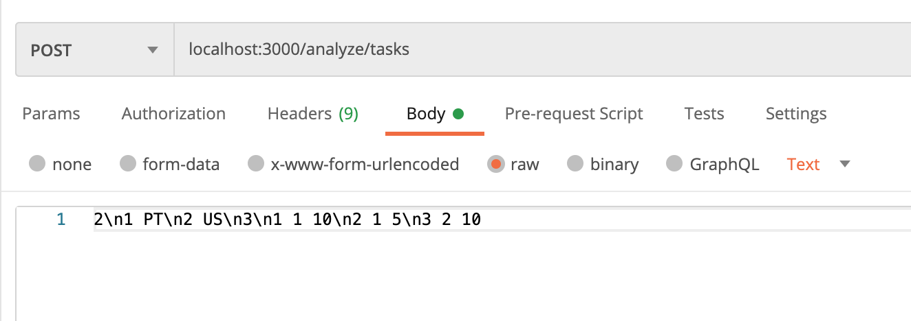
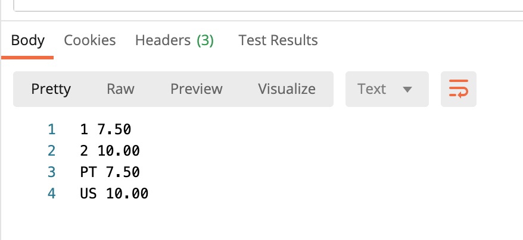
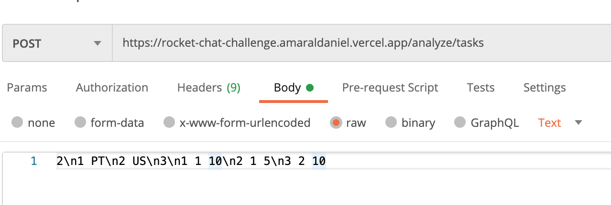

# RocketChatChallenge

## Unit testing
In the terminal with the location on the root folder, run:

    npm test
    
## CLI File importing 
**TODO**

## API Endpoint
In the terminal with the location on the root folder, run:

    npm start

The API will be available here [http://127.0.0.1:3000/analyze/tasks](http://127.0.0.1:3000/analyze/tasks)

The allowed HTTP method is **POST** with a body such as the example given in the challenge:

The expected result is:

## Vercel Deployment
The app is live on:

    https://rocket-chat-challenge.amaraldaniel.vercel.app/

Visit it in the web browser just to make sure that the app is running. To access the endpoint access:

        https://rocket-chat-challenge.amaraldaniel.vercel.app/analyze/tasks

with Postman or similar like the following example: 

